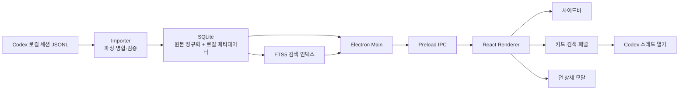

# CodexCardFeed

**Codex 대화를 프로젝트·스레드·턴 단위로 정리하고, 다시 찾고, 관리하는 로컬 데스크톱 앱**

Codex를 사용하면 많은 토큰을 소모해 유용한 결과물을 만들지만, 시간이 지나면 필요한 내용을 다시 찾기 어렵고 비슷한 질문을 반복하게 됩니다. CodexCardFeed는 이렇게 빠르게 생산되고 잊히는 대화를 로컬 데이터로 모아 카드형 UI로 재구성합니다.

이 앱은 새로운 AI 결과물을 생성하는 도구가 아닙니다. 이미 만들어진 Codex 결과물을 검색 가능한 자료로 끌어올리고, 사용자의 기준으로 분류·관리해 재사용할 수 있게 하는 도구입니다.

## 핵심 가치

- **종합** — Codex의 로컬 세션을 한 곳에 모읍니다.
- **분류** — 프로젝트, 스레드, 턴, 아이템 계층으로 대화를 구조화합니다.
- **관리** — 제목, 태그, 핀, 메모를 원본과 분리해 저장합니다.
- **검색** — 질문, 최종 답변, 턴 제목, 태그, 메모를 빠르게 찾습니다.

## 주요 기능

### 대화 탐색

- Codex 로컬 세션 JSONL import
- 프로젝트, Historical, Chats 영역 구분
- 프로젝트와 스레드 목록을 사이드바에서 탐색
- 스레드의 턴을 카드 형태로 표시
- 질문만 간결하게 모아보는 질문 모드
- 턴 상세 모달에서 사용자 질문, 최종 답변, 중간 작업과 원본 아이템 확인
- 답변의 Markdown 렌더링과 긴 내용의 전체 보기

### 검색

- 사이드바에서 프로젝트명, 스레드명, 태그 검색
- 현재 스레드의 질문, 최종 답변, 태그, 메모 검색
- 전체 턴 검색 결과를 별도 탭으로 열기
- 전체 검색 대상
  - 사용자 질문
  - 최종 답변
  - 턴 제목
  - 태그
  - 메모
- SQLite FTS5 기반 검색 인덱스와 짧은 검색어용 LIKE 검색
- 검색 결과에서 프로젝트, 스레드, 턴 위치 확인
- 검색어 일치 부분 강조 표시

### 로컬 관리

- 프로젝트, 스레드, 턴 제목 수정
- 태그를 개별적으로 추가·삭제
- 핀 고정
- 메모 저장
- 로컬 메타데이터 영역 접기/펼치기
- 원본 Codex 로그는 수정하지 않고 앱 전용 SQLite 데이터베이스에 관리 정보 저장

### 사용량과 실행 정보

- 턴별 토큰 사용량 표시
- 턴 카드에 사용 모델 표시
- 턴 카드에 추론 강도 표시
- 입력, 출력, 캐시, reasoning 등 상세 토큰 사용량 확인
- 현재 스레드를 Codex에서 열기

### 유지보수와 데이터 관리

- Codex 세션 재import
- 파일 변경 감지와 증분 import
- importer 메타데이터 구조 변경 시 재파싱
- Data check
  - 데이터베이스의 구조적 무결성 점검
  - 누락된 참조, 순번 문제, 중복·불완전 데이터 확인
- Session diagnosis
  - Codex 원본 세션과 가져온 데이터의 매핑 상태 점검
  - 누락·변경·삭제된 원본 세션 확인
  - 문제 발생 턴 링크 제공
- 진단 결과의 전체 건수와 새로 발생한 건수 구분
- SQLite 데이터베이스와 경로 설정 백업 내보내기
- 백업 데이터베이스 다시 열기
- Codex 원본 경로와 CodexCardFeed 데이터베이스 경로 변경

## 화면 구성

CodexCardFeed의 화면은 Codex의 탐색 흐름을 참고해 세 영역으로 구성됩니다.

| 영역 | 역할 |
| --- | --- |
| 사이드바 | Projects, Historical, Chats를 구분하고 프로젝트·스레드를 탐색합니다. 경로 설정과 진단도 여기서 엽니다. |
| 오른쪽 패널 | 선택한 스레드의 턴 카드, 질문 목록, 전체 검색 결과를 표시합니다. |
| 상세 모달 | 선택한 턴의 메타데이터와 모든 아이템을 표시합니다. 사용자 질문과 최종 답변은 기본으로 펼치고 중간 작업은 접어둡니다. |

## 데이터 모델

### Project

Codex의 작업 공간 또는 프로젝트 맥락을 나타냅니다. 여러 스레드를 포함할 수 있으며, 원본 상태에 따라 active, historical, removed로 표시될 수 있습니다.

### Thread

하나의 Codex 대화 세션입니다. 원본 세션 파일 경로와 프로젝트 연결 정보를 가지며, 앱의 사이드바에서 선택하는 대화 단위입니다.

### Turn

한 번의 사용자 질문을 중심으로 이어진 어시스턴트의 중간 작업과 최종 답변을 묶은 단위입니다. CodexCardFeed에서 검색과 카드 표시의 기본 단위입니다.

### Item

턴 안에 기록된 개별 이벤트입니다. 다음과 같은 내용이 포함될 수 있습니다.

- 사용자 메시지
- 진행 메시지와 최종 답변
- reasoning
- 파일 읽기·수정, 명령 실행 등의 도구 작업
- 웹 검색 및 검색 결과
- 토큰 사용량 이벤트

## 동작 구조



모든 원본 세션 파싱과 SQLite 처리는 Electron main 프로세스에서 수행합니다. renderer는 preload에서 제공하는 제한된 IPC API를 통해 필요한 데이터를 요청하므로, renderer에 Node.js 파일 시스템 접근 권한을 직접 노출하지 않습니다.

## 기술 스택

| 영역 | 기술 |
| --- | --- |
| 데스크톱 런타임 | Electron 37 |
| UI | React 19, TypeScript 5 |
| 개발·빌드 | Vite 7, electron-builder |
| 데이터베이스 | Node.js 내장 SQLite API |
| 검색 | SQLite FTS5 trigram 인덱스 |
| Markdown | react-markdown, remark-gfm |
| 테스트 | Node.js 테스트 러너 |

## 프로젝트 구조

```text
CodexCardFeed/
├─ electron/
│  ├─ main.js                 # Electron 창, 경로, Codex 열기
│  ├─ preload.js              # renderer에 제공하는 제한된 IPC 브리지
│  ├─ ipc.js                  # IPC 핸들러 등록
│  ├─ db.js                   # SQLite 스키마, 마이그레이션, 조회·저장
│  ├─ search-index.js         # FTS5 검색 인덱스
│  ├─ backup.js               # 데이터베이스·경로 설정 백업
│  ├─ integrity.js            # 데이터 무결성 검사
│  ├─ background-tasks.js     # import·진단 백그라운드 작업
│  └─ importer/
│     ├─ parser.js            # Codex JSONL 파싱
│     ├─ merge.js             # 세션·턴 병합
│     ├─ repository.js        # SQLite 저장
│     ├─ validation.js        # 입력 구조 검증
│     └─ diagnosis.js         # 원본 세션 진단
├─ src/renderer/
│  ├─ components/             # 사이드바, 패널, 카드, 모달
│  ├─ hooks/                  # 선택, 검색, 메타데이터, import 상태
│  ├─ lib/                    # 표시 모델과 입력 처리
│  └─ styles/                 # 화면 영역별 CSS
├─ tests/electron/            # importer·DB·백그라운드 작업 테스트
├─ package.json
└─ README.md
```

## 빠른 시작

### 요구 사항

- Node.js와 npm
- Codex가 설치되어 있고 로컬 세션 데이터가 존재하는 환경

현재 Windows portable 실행 파일 패키징을 지원합니다. 개발 실행 자체는 Electron이 지원하는 환경에서 가능합니다.

### 설치

```bash
npm ci
```

### 개발 실행

```bash
npm run dev
```

Vite 개발 서버와 Electron 앱을 함께 실행합니다.

### 프로덕션 빌드

renderer 빌드만 수행하려면 다음 명령을 사용합니다.

```bash
npm run build
```

Windows x64 portable 실행 파일을 생성하려면 다음 명령을 사용합니다.

```bash
npm run dist:win
```

생성 결과는 `release-portable/` 디렉터리에 저장됩니다.

## 검증 명령

```bash
npm run typecheck
npm test
```

`npm test`는 importer 파싱·병합, SQLite 저장과 마이그레이션, 검색 인덱스 연계, 백그라운드 작업 결과를 검증합니다.

## 데이터와 경로

기본 경로는 Windows 기준으로 다음과 같습니다.

| 항목 | 기본 경로 예시 |
| --- | --- |
| Codex 원본 세션 | `C:\Users\<user>\.codex` |
| CodexCardFeed SQLite | `C:\Users\<user>\AppData\Roaming\Electron\codex-card-feed.sqlite` |
| 경로 설정 | `C:\Users\<user>\AppData\Roaming\Electron\codex-card-feed-settings.json` |

앱의 `Paths` 패널에서 현재 지정된 경로를 확인하고 변경할 수 있습니다. 데이터베이스 경로를 변경하면 기존 데이터베이스를 새 위치로 열거나 복사해 사용할 수 있습니다.

## 원본 데이터와 개인정보

- Codex 원본 세션 파일은 직접 수정하지 않습니다.
- 제목, 태그, 핀, 메모는 Codex 원본이 아닌 CodexCardFeed의 SQLite 데이터베이스에 저장합니다.
- 검색은 로컬 SQLite 인덱스를 사용합니다.
- 현재 요약 API나 외부 AI API를 사용하지 않습니다.
- 백업은 사용자가 선택한 로컬 폴더에 데이터베이스와 경로 설정을 저장합니다.
- 원본 대화에는 개인 정보나 프로젝트 정보가 포함될 수 있으므로 데이터베이스와 백업 파일의 접근 권한을 관리해야 합니다.

## 현재 제한 사항

- Codex 원본 저장 포맷에 의존하므로 포맷 변경 시 importer 검증과 재파싱이 필요할 수 있습니다.
- Codex 원본 대화 내용을 이 앱에서 수정하지 않습니다.
- Codex 내부 네비게이션을 직접 제어하지 않으므로 특정 턴으로 바로 이동할 수 없습니다.
- `Open in Codex`는 현재 스레드 단위로 Codex를 여는 기능입니다.
- 현재 배포 설정은 Windows x64 portable 실행 파일을 대상으로 합니다.

## 라이선스

라이선스 정책은 저장소의 라이선스 파일과 GitHub 저장소 설정을 따릅니다.
